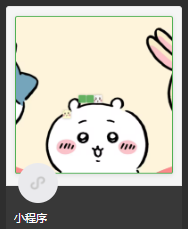

# 贪吃蛇微信小程序


## 项目简介

这是一个基于微信小程序的贪吃蛇游戏，具有以下特点：
- 使用自定义图片作为蛇头和食物
- 支持背景图片自定义
- 正方形方向控制按钮和圆形暂停按钮
- 游戏暂停/继续功能
- 得分记录和最高分保存

## 功能特点

1. **游戏控制**：
   - 上、下、左、右方向键控制蛇的移动
   - 中间暂停按钮可暂停/继续游戏
   - 游戏结束可重新开始

2. **视觉效果**：
   - 自定义蛇头图片(自动根据方向旋转)
   - 自定义食物图片
   - 自定义游戏背景图
   - 蛇身半透明效果，在背景上清晰可见

3. **数据记录**：
   - 实时显示当前得分
   - 自动保存最高分(本地缓存)

## 文件结构

```
snake-game/
├── pages/            # 页面文件
│   └── index/        # 游戏主页面
├── images/           # 图片资源
│   ├── snake-head.png # 蛇头图片
│   ├── food.png      # 食物图片
│   └── game-bg.jpg   # 游戏背景图
└── app.json          # 小程序配置文件
```

## 使用说明

1. **准备工作**：
   - 准备三张图片放入`/images/`目录：
     - 蛇头图片(`snake-head.png`)
     - 食物图片(`food.png`)
     - 游戏背景图(`game-bg.jpg`)

2. **导入项目**：
   - 使用微信开发者工具导入本项目

3. **自定义设置**：
   - 修改`index.js`中的`backgroundImage`路径使用自己的背景图
   - 调整`cellSize`可改变游戏格子大小
   - 修改`gameLoop`中的间隔时间可调整游戏速度

## 开发建议

1. 背景图建议使用浅色或低对比度图片，确保游戏元素可见
2. 图片大小建议压缩到100KB以内，提高加载速度
3. 如需调整难度，可修改蛇的初始长度或游戏区域大小

## 运行效果

游戏界面包含：
- 顶部显示当前得分和最高分
- 中间为游戏区域(带背景图)
- 底部为方向控制区和暂停按钮
- 游戏结束显示重新开始按钮

## 注意事项

1. 所有图片需放入`/images/`目录
2. 首次运行需在微信开发者工具中构建npm(如有需要)
3. 最高分保存在本地缓存中，清除缓存会重置最高分